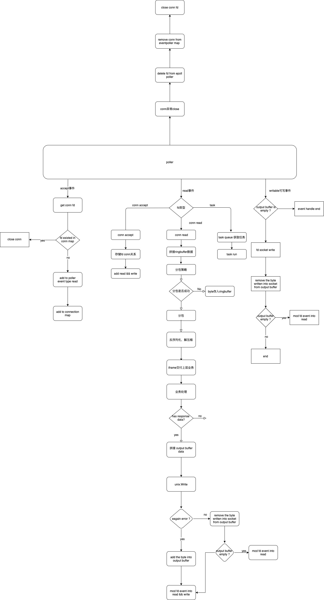

# aeolus
### 简介
aeolus是一款高性能Golang网络库，有别于传统golang tcp goroutine-per-connection的模式，aeolus采用Reactor模型搭建

### 项目进度
aeolus依然在成长中，目前没有达到稳定线上可用的状态，但我会不停的commit，直到它稳定可用

### 欢迎交流
如果你是网络编程或者go的爱好者，欢迎你加我的微信，我们可以一起交流

